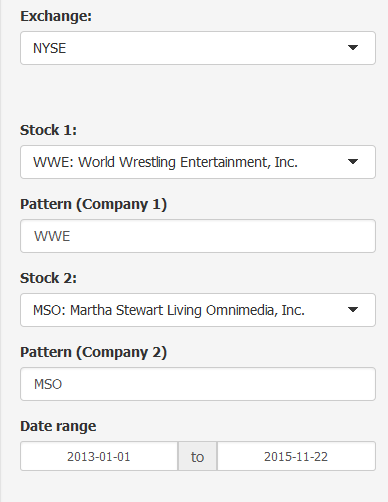
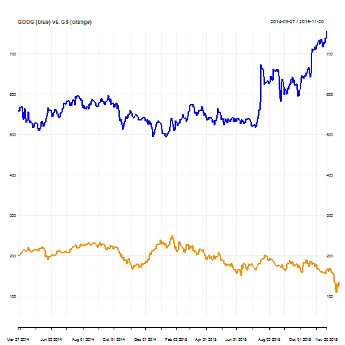
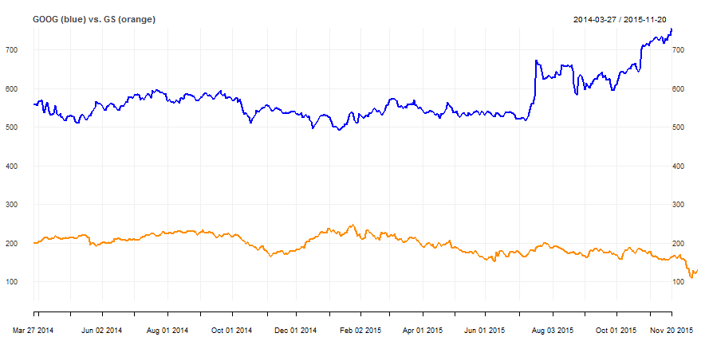

## Welcome to stockVis

This application will allow the user to select two companies from one of three different stock exchanges (NYSE, NASDAQ, or AMEX) and then the stock proces over a given period of time (selected by the user) will be charted against each other to allow the user to directly compare the returns of the companies in the time period selected.

This uses many of the functions from the quantmod package.

--- .class #id 

## Entering the companies

The companies can either be directly entered, or you can enter a pattern and the drop-down menus will be populated with the first 1000 companies matching that pattern.  You can also choose to adjust for inflation.  


---

## Viewing the plot

The application is reactive in that it will automatically update the graph.  
Note: I am having difficulty getting slidify to actually plot the second line on the graph.  Here is the code to generate the graph:


```r
library(quantmod)
thm <- chart_theme()
thm$col$line.col <- 'blue'
getSymbols("GOOG")
getSymbols("GS")
chart_Series(Cl(GOOG), type='line', theme=thm, name="GOOG (blue) vs. GS (orange)")
add_Series(Cl(GS), on=1)
```

---

Here is what slidify is outputting:  

```
## [1] "GOOG"
```

```
## [1] "GS"
```

  

---
And here is what the application ACTUALLY outputs:
  

